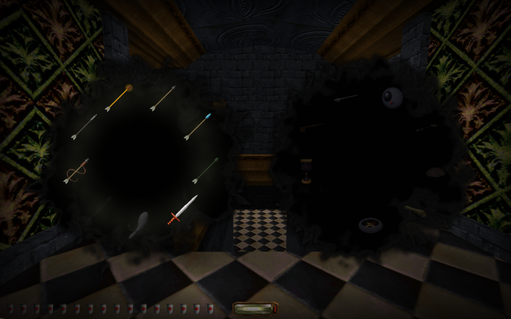
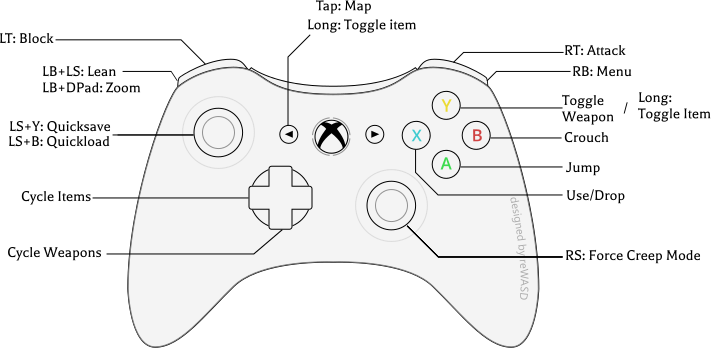

This mod adds full controller support to Thief 1 and Thief 2.

[](https://www.youtube.com/watch?v=HY29B94PAuA)
[Demo Video](https://www.youtube.com/watch?v=HY29B94PAuA)


Features
--------
- Friendly radial menus for weapons and inventory
- Keyboard/mouse radial supprt
- Time slows when the menu is open
- D-Pad navigation of key menus
- Optional automatic key management (where the mission makes it possible), based off [Sarcoth's excellent J4F Keychain](https://github.com/saracoth/newdark-mods/releases/latest).


Installation
------------

1. Take a backup of your thief `user.bnd` file
2. You'll need the NewDark 1.27 or 1.28. If in doubt, [use RoguePatcher](https://www.ttlg.com/forums/showthread.php?t=152977) or [TFix](https://www.ttlg.com/forums/showthread.php?t=134733). You can also directly install [NewDark 1.28]([https://www.ttlg.com/forums/showthread.php?t=152974](http://ariane4ever.free.fr/ariane4ever/viewtopic.php?f=2&t=7502)) (per [this TTLG thread](https://www.ttlg.com/forums/showthread.php?t=152974)). I find NewDark 1.28 works best.
5. Copy `dinput.dll` from `MODS/gamepad/` into your game folder

*For Steam Deck users:* Add `WINEDLLOVERRIDES="dinput=n,b" %command%` to your launch arguments in Steam  

For more details, and troubleshooting, see [INSTALLING.md](INSTALLING.md)

Controls
--------




```
Left Stick          Move (analogue)
Right Stick         Look / camera

A                   Jump / mantle
B                   Crouch
X                   Use item
                    Throw Junk (if holding)

Y (tap)             Equip/Holster weapon
Y (hold)            Drop item

LT                  Block
RT                  Attack / use weapon

LB + Left Stick     Lean left / right / forward
RB (hold)           Radial inventory menu (select with left/right sticks
RB (hold) + Y		Unequip Weapon+Item

RS click            Force sneak speed

D-pad Up            Cycle Weapons (next)
D-pad Down          Cycle Weapons (previous)
D-pad Left          Cycle Items (previous)
D-pad Right         Cycle Items (next)

LB + Dpad Up/Down   Zoom in/out (Thief 2)
					N.B. does not work with arrows if Bow Zoom is enabled (game limitation)
LB + Dpad Left		Cycle Lockpick (Triangle/Square picks)

Back                Map
Back (hold)			Equip/Unequip item
Start               Game menu

L3+Y				Quicksave
L3+B				Quickload

Movement has two speed modes (toggle with LS click):
  Slow mode: gentle stick = walk, full deflection = run
  Fast mode: small range for walk, rest is run
Full stick deflection auto-exits slow mode. Keeping the stick below 30% for 1 second auto-returns to slow mode.
```

Configuration
-------------

Use *MODS/gamepad/GamepadConfig.exe* to adjust deadzone, sensitivity, customise button bindings, and more. You can also manually add your own gamepad.ini in the game's folder and customise it.

When adjusting look sensitivity, I find it best to keep the game's Mouse Sensitivity reasonably low and increase the mod's sensitivity - this will provide smoother motion at slow speeds (due to how passing mouse inputs to games works).


Feedback
--------

Feedback welcome!

 - Create an issue on this repository
 - [TTLG](https://www.ttlg.com/forums/showthread.php?t=153292&p=2536935#post2536935)
 - [Bluesky](https://bsky.app/profile/levitime.com)
 - Dromed Discord
