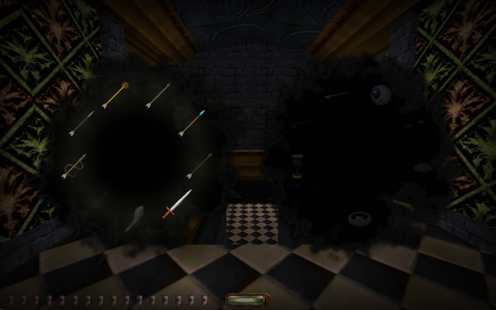
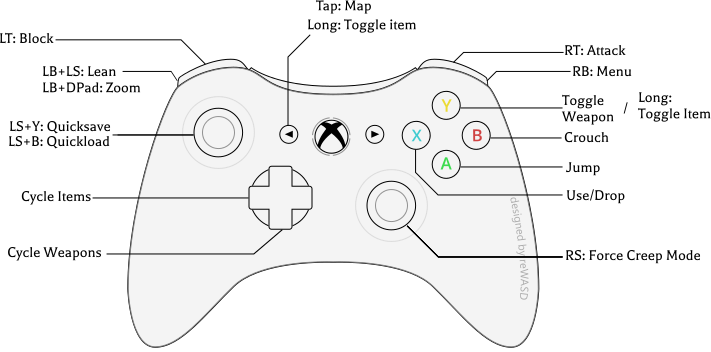

This mod adds full controller support to Thief 1 and 2.

[](https://github.com/petergeneric/thief-dark-project-controller-mod/releases/download/v2.2/gamepad.zip)  
[](https://www.gog.com/game/thief_gold)

[](https://www.youtube.com/watch?v=HY29B94PAuA)
[Demo Video](https://www.youtube.com/watch?v=HY29B94PAuA)


Features
--------
- Friendly radial menus for weapons and inventory
- Keyboard/mouse radial supprt
- Extensive support for advanced haptics on Dualsense (including via bluetooth), and rumble
- Time slows when the menu is open
- D-Pad menu navigation
- Rumble support
- Optional automatic key management (where the mission makes it possible), based off [Sarcoth's excellent J4F Keychain](https://github.com/saracoth/newdark-mods/releases/latest).


GOG Installation / Update
-------------------------
[The GOG version of Thief Gold](https://www.gog.com/en/game/thief_gold) comes with v2 of this mod pre-installed, this is the easiest way to get started with Thief.
Install the GOG version, then launch Gamepad Settings from GOG Galaxy, go to the About tab and Check For Updates to update to the latest version.

Future GOG updates could re-install earlier versions of the mod, so you may wish to copy your install out of the GOG Galaxy folder.

Manual Installation
-------------------

See [Install Guide](INSTALLING.md) for full information. Basic process is:
1. Make sure you have **NewDark 1.27 or 1.28** - [TFix Lite](https://www.ttlg.com/forums/showthread.php?t=134733) for Thief 1, [T2Fix Lite](https://www.ttlg.com/forums/showthread.php?t=149669) for Thief 2.
3. Download `gamepad.zip` below and then run `GamepadConfig.exe` inside the .zip. Point it at your Thief or Thief 2 game folder, and it will install itself (for Steam Deck, run it from the `steam-deck.zip` file instead)
4. See *Steam Deck, Proton and Wine* below for additional steps for Steam Deck

You can also install using [DMM](https://github.com/pshjt/dmm). If you do this, you'll need to run `MODS/gamepad/GamepadConfig.exe` to finish the installation.

Controls
--------

<details open>
<summary><b>Xbox</b></summary>



</details>

<details>
<summary><b>DualSense</b> (native - disable Steam Input)</summary>


</details>


<details>
<summary><b>Steam Deck</b></summary>


</details>


<details open>
<summary><b>Default Bindings</b> (click to show/hide)</summary>

```
Left Stick          Move (analogue)
Right Stick         Look / camera

A                   Jump / mantle
                    Menu: Confirm
B                   Crouch
                    Menu: Back / Skip Cinematic
X                   Use item
                    Throw Junk (if holding)

Y (tap)             Equip/Holster weapon
Y (hold)            Drop item

LT                  Block
RT                  Attack / use weapon

LB + Left Stick     Lean left / right / forward
RB (hold)           Radial inventory menu (select with left/right sticks
RB (hold) + Y		Unequip Weapon+Item

RS click            Force sneak speed

D-PAD           Menu: navigate on-screen menu
  Up            Cycle Weapons (next)
  Down          Cycle Weapons (previous)
  Left          Cycle Items (previous)
  Right         Cycle Items (next)

LB + Dpad Up/Down   Zoom in/out (Thief 2)
					N.B. does not work with arrows if Bow Zoom is enabled (game limitation)
LB + Dpad Left		Cycle Lockpick (Triangle/Square picks)

Back                Map
Back (hold)			Equip/Unequip item
Start               Game menu

L3+Y				Quicksave
L3+B				Quickload
                    Menu: Quickload

Movement has two speed modes (toggle with LS click):
  Slow mode: gentle stick = walk, full deflection = run
  Fast mode: small range for walk, rest is run
Full stick deflection auto-exits slow mode. Keeping the stick below 30% for 1 second auto-returns to slow mode.
```

</details>

Configuration
-------------

Use *MODS/gamepad/GamepadConfig.exe* to adjust a range of settings and customisations.
Some configuration options are available in-game. Click on the Settings button in the in-game radial.

When adjusting look sensitivity, I find it best to keep the game's Mouse Sensitivity reasonably low and increase the mod's sensitivity - this will provide smoother motion at slow speeds (due to how passing mouse inputs to games works).
For best results, enable high dpi mouse settings for the game per the [Install Guide](INSTALLING.md#recommended-high-dpi-mouse-settings).

Feedback
--------

If you run into a problem, please check the [Troubleshooting Guide](TROUBLESHOOTING.md), and raise a github issue if that doesn't help.

Links
-----

 - [TTLG](https://www.ttlg.com/forums/showthread.php?t=153292&p=2536935#post2536935)
 - [ModDB](https://www.moddb.com/mods/thief-controller-mod)
 - Visit the Dromed Discord
